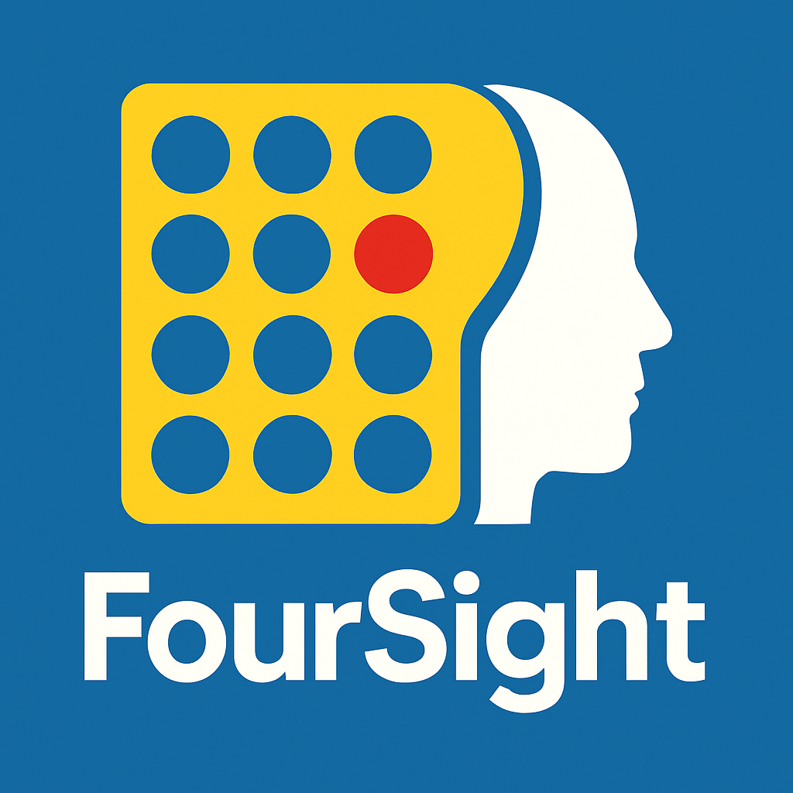

<div align=center>
  
</div>

# Four Sight
A rust based engine for [Connect Four](https://en.wikipedia.org/wiki/Connect_Four). It uses MCTS search for optimal move prediction. It also support UCI-ish commands for communication

Sample output for a game I played against another bot.
```bash
> uci
id name foursight 1.0.0
id author Saphereye
option name Iterations type spin default 50000
option name ExplorationConstant type string default 1.414
uciok
> go
bestmove 4 # This is the evaluation at starting position, the answer the columns number
...
> position startpos moves 4 4 4 4 2 3 3 3 3 2 1 2 2 4 6 7 6 3 6 6 7 4 7
> go
bestmove 2
> d # This displays the current board in an ascii format
|.|.|.|O|.|.|.|
|.|.|O|O|.|.|.|
|.|X|X|O|.|O|.|
|.|O|O|X|.|X|X|
|.|O|X|O|.|X|X|
|X|X|O|X|.|X|O|
|1|2|3|4|5|6|7|
> eval # Gives the evaluation for this position as per the engine
info string === Position Evaluation ===
info string Running MCTS evaluation...
info string Current player: Player 2 (O)
info string Position score: 0.974 (positive favors current player)
info string Assessment: Strong advantage
info string Player 1 threats: 0, Player 2 threats: 0
info string === Move Analysis ===
info string   Move 5: +1.000 (5397 simulations)
info string   Move 7: +0.985 (6999 simulations)
info string   Move 6: +0.984 (7027 simulations)
info string   Move 3: +0.980 (7663 simulations)
info string   Move 1: +0.968 (9699 simulations)
info string   Move 2: +0.954 (13215 simulations)
```
